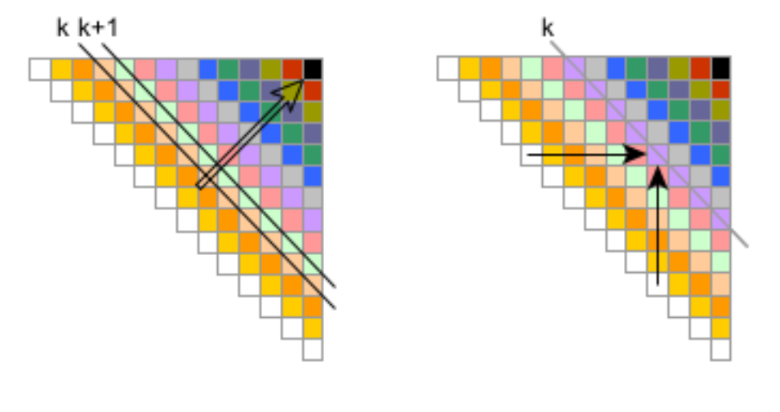

# Distributed-Wavefront

This project implements a distributed version of the Wavefront computation for the SPM course (academic year 23/24), focused on parallel programming using FastFlow and MPI.

## Project Overview

This project builds on the Wavefront computation problem from Assignment 1. Instead of using a “wasting time” work function, we compute diagonal elements of a matrix $M$ (size $N \times N$, with double precision elements).

For each diagonal element, the new distributed version computes the $n-k$ diagonal element $e_{m, m+k}^k$, where $m \in [0, n-k[$, as the result of a dot product between two vectors $v_m^k$ and $v_{m+k}^k$, which are composed of elements from the same row $m$ and column $m+k$. Specifically:

$$
e_{i,j}^k = \sqrt[3]{\langle v_m^k, v_{m+k}^k\rangle}
$$

<p align="center">
  
</p>

### Matrix Initialization

- The values of the major diagonal elements $e_{m, m}^0$ are initialized with the formula $\frac{m+1}{n}$.

### Tasks

You are required to implement two parallel versions:
1. **Single Multi-Core Machine**: Using the FastFlow library.
2. **Cluster of Multi-Core Machines**: Using MPI (Message Passing Interface).

## Code Delivery

The code must be delivered as a tarball (`tgz` or `zip`) that includes:
- **PDF Document**: Detailed description of the parallelization strategy, performance analysis, plots showing speedup, scalability, and efficiency, along with comments and problems faced.
- **Makefile/CMake**: To compile the source code on the `spmcluster` machine.
- **SLURM Scripts**: For running tests on the `spmcluster` using the SLURM workload manager.

## Performance Metrics

The project document should include:
- **Speedup**: Measure how much faster the computation runs with increased resources.
- **Scalability**: Evaluate how well the program scales with additional processing power.
- **Efficiency**: Analyze resource usage to identify bottlenecks or inefficiencies.

## Compilation and Execution

To compile the project, ensure you have the required libraries installed, such as FastFlow or MPI. The included `Makefile` or `CMake` file will handle the compilation. The tests can be executed using SLURM scripts provided in the directory.

### Compilation Instructions

```bash
cmake -S . -B build
cd build
make
